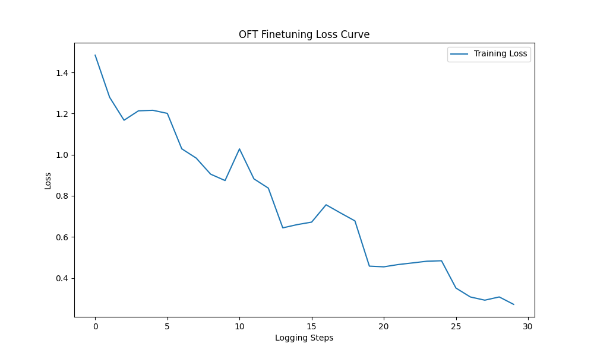

# Medical QA Finetuning with Qwen2.5 & OFT

This project implements **Orthogonal Finetuning (OFT)** on the **Qwen2.5-1.5B-Instruct** model using the **MedQuAD** dataset. By learning an orthogonal transformation matrix, we adapt the large language model to the medical domain while preserving its pre-trained knowledge distribution.

## 🌟 Key Features
* **Parameter-Efficient**: Trains < 0.1% of total parameters, significantly reducing storage and compute costs.
* **Orthogonal Constraint**: Preserves the hyperspherical energy of neurons, ensuring stability and preventing catastrophic forgetting.
* **High Performance**: Native support for **BF16** precision, optimized for the **NVIDIA RTX 5090** architecture.

## 💻 Hardware Environment
* **GPU**: NVIDIA RTX 5090 (32GB VRAM)
* **CUDA**: 13.0
* **Framework**: PyTorch 2.8.0, PEFT 0.14.0+, Transformers 4.49.0+

## 📂 Project Structure
```text
.
├── train_oft.py          # Main training script (OFT implementation)
├── experiment.py         # Evaluation script (Loss, PPL, ROUGE-L)
├── results/              # Output directory
│   ├── loss_curve.png    # Visualized training progress (Final Loss: 0.2718)
│   └── qwen-oft-medical/ # Saved OFT Adapters (SafeTensors)
└── README.md
```

## 🚀 Quick Start

### 1. Installation
```bash
pip install torch transformers peft datasets evaluate rouge_score modelscope
```

### 2. Training
```bash
python train_oft.py
```

### 3. Evaluation
```bash
python experiment.py
```

## 📊 Experimental Results

### Training Loss Curve


### Quantitative Metrics (Test set N=100)
| Metric | Base Model (Qwen2.5) | OFT-Tuned Model | Improvement |
| :--- | :--- | :--- | :--- |
| **Evaluation Loss** $\downarrow$ | 1.8294 | **1.4532** | -20.6% |
| **Perplexity (PPL)** $\downarrow$ | 6.2302 | **4.2769** | -31.3% |
| **ROUGE-L Score** $\uparrow$ | 0.1479 | **0.2895** | **+95.7%** |

### Qualitative Comparison
* **Input**: *"Is Tietze syndrome inherited?"*
* **Base Model**: Provides general information but is less specific about mutation rates and inheritance patterns.
* **OFT-Tuned**: Delivers a precise clinical response, noting the sporadic nature of the condition (1 in 30,000 births) and its role in multisystem disorders, aligning with MedQuAD's authoritative style.